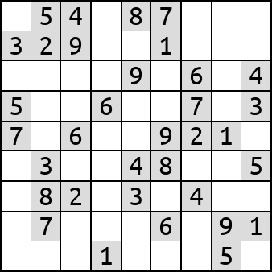
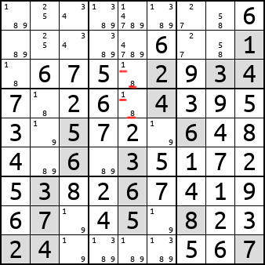
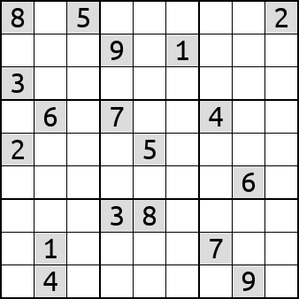

# Решаем sudoku используя pytorch/nn



В этом репозитории попытаюсь решить комбинаторную задачу, которая обычно решается при помощи циклов, условных переходов и рекурсии.
Но использовать для этого буду нейросеть с коэффициентами заданными руками. Т.е. без использования обучения.
Буду программировать нейросеть классическим способом, написав руками код.
Имеет ли смысл такое программирование? Однозначно да. Например очень многие алгоритмы computer vision переносятся на нейросети.
При этом получаются очень компактные и эффективные нейросети.

## Введение: О базовой основе программирования.

Когда мы программируем, то обычно привыкли к императивному программированию, в стиле:
``` cpp
 if (a == 12)
    b = 23;
 else
    do_some();
```

На чём бы мы не писали C++/Java/Rust/Python - базовые примитивы одни. Функции, переменные, списки, условные переходы и циклы.
Народ использующий функциональные языки может подумать, что они чем-то отличаются от императивных. Но нет. Разница мизерная, на уровне "синтаксического сахара".

Особняком стоят HDL языки, в короых есть массовый параллелизм. Это Verilog, VHDL и подобные. 
``` verilog
always_ff @(posedge clock)
begin
	if(clock_count==CLOCKS_PER_TICK-1)
	begin
		clock_count <= 0;
		signal_out <= 1;
	end
	else
	begin
		clock_count <= clock_count+1'd1;
		signal_out <= 0;
	end
end
```
здесь "переменные" clock_count и signal_out заполняются параллельно. А циклик "always_ff" крутится не переставая всё время, пока наша FPGA включена.

Есть и третий "язык программиирования" это матричные вычисления. Т.е. у нас есть куча операций вида:
``` cpp
M3 = F1(M1,M2);
M4 = F2(M3, M1); 
M5 = F3(M4)
```
где F1, F2, F3 - функции. M1, M2, M3, M4, M5 - матрицы с данными.

На этом тоже можно программировать. И крайне удобным вариантом для такого программирования являются нейросети.

## pytorch

pytorch крайне удобный framework для подобного программирования. Обширный набор функций, возможность испольнять нейросети как на CPU так и на GPU. Поэтому именно им и буду пользоваться.

## базовые примитивы

Для хранения данных у нас есть тензора `torch.Tensor`. 
Классически тензор у нас четырёхмерный [N,C,H,W] для случая когда бы обрабатываем 2D изображения. Судоку можно считать 2D изображением, только маааленьким 9x9 пикселей.
  - N количество элементов.
  - C (color/channels) количество цветов или каналов с информацией.
  - H (height) высота изображения
  - W (width) ширина изображения

В нашем случае это превращается в:
  - N количество параллельно решаемых судоку
  - С 9 каналов, символизирующих возможность появления числа в этой ячейке.
  - H,W так и  остаются шириной и высотой поля судоку 9x9

Функции - всё те-же, к которым мы привыкли при создании нейросетей. Conv2D, ReLu, MaxPool2d и совсем базовые fmin, fmax, add, sub, mul.
Всё это достаточно успешно может выполняться на NPU (нейроакселераторах). Исключение пожалуй составляет пара MaxPool2d/MaxUnpool2d которая не везде поддерживается, но она как оказалась очень важна для программирования.

## нерекурсивные проверки

Базовые операции сосредоточены у нас в файле sudoku_nn/sudoku_fun.py
При помощи операций `Conv2d/ReLU/MaxPool2d/torch.mul` можно сделать все эти операции. 
Операции `torch.sub/torch.add` сводятся к `Conv2d`.
Операции `torch.clamp/torch.fmin/torch.fmax` сводятся к комбинации `Conv2d+ReLu`.

Большинство базовых проверок делаются при помощи суммирования битиков валидности по горизонтали, вертикали, в квадрате 3x3 либо по каналам.
Тут можно глянуть класс `SudokuSumDownsample`.

Нерекурсивные проверки сводяся к тому, что у нас есть условие, и мы по нему однозначно убираем какую-либо возможную цифирку из нашего тензора.

Самая сложная проверка находится в классе `SudokuDigitsDoubles`



Обратите внимание на столбец в котором есть подчеркнутые красным цифры 1 и 8.
Они могут быть только в этих ячейках, и соотвественно в других ячейках этого столбца присутствовать не могут.
Это позволяет в самой нижней ячейке этого столбца (где числа 1,8,9) вычеркнуть 1, 8 и оставить только одно число 9.

Сложность этой проверки в том, что приходится искать двойки одинаковых чисел. В классе `SudokuDigitsDoubles` это делается крайне
ресурсоёмким способом. Т.е. перебираются все комбинации чисел (а их 36 штук) для всех ячеек.

## рекурсия

Сделать рекурсию на нейросетях - нетривиальная задача. Я довольно долго об этом думал.
Основная задача - это сделать.

Основная идея как сделать стек содержится в классе `sudoku_nn/recursion_fun.py Iterate2D`. Здесь мы последовательно итерируемся по массиву input (двумерному), мо числам больше нуля. Числа не обязательно должны быть последовательными. И если у нас будет 2 одинаковых числа, то сначала на выход выдастся одно из этих чисел, а потом другое. По факту на выходе у нас маска где все значения нули, и только одно из значений - ненулевое. "Волшебная" конструкция, которая позволяет это сделать это применение последовательно `MaxPool2d/MaxUnpool2d` ко всему массиву. `MaxPool2d` выбирает один и только один максимальный элемент. `MaxUnpool2d` - создаёт маску, где все значения нулевые кроме выбранного.

Дальше уже дело техники, как из этого простого класса сделать нормальный стек. Вся рекурсия происходит в классе `SudokuRecursionControl`. Отмчу несколько интересных моментов. У нас нет условных переходов. Поэтому выбор элементов происходит при помощи `lerp(a, b, select)`. Если select=0, то на выходе будет a. Если select=1, то на выходе будет b. Т.е. когда мы делаем рекурсию, то у нас параллельно считаются варианты:
 - будем выбирать элемент и класть его в стек
 - будем вытаскивать элемент из стека, так-как произошла ошибка
 - пропускаем шаг рекурсии, т.к. базовые (нерекурсивные) алгоритмы что-то вычеркнули

Такая вот суперпозиция сознания! Очень похоже на тот стиль, в котором на Verilog писать надо.

Отмечу ещё один момент. Четные и нечётные значения стека извлекаются по разному. Нечётные значения - это значения выбора варианта. Когда они извлекаются, то текущий тупиковый вариант надо стереть. Чётные значения - это значения, которые насчитались базовыми алгоритмами. Их надо просто объединить с текущей маской.


И вот что получилось. Квадратики - это, то что алгоритм "держит в уме", что-бы потом вернуться, если текущий вариант выбора окажется тупиковым.
Например красный квадратик около цифры 7 означает, что запомнили цифру 9.


## тесты производительности

Про оптимизацию - все матрицы могут работать на int8. Почти все могут работать в int4. И достаточно большому количеству матриц хватило-бы даже int1 точности, т.е. обычных булевых значений. И это кстати то направление, где ещё надо интерфейсу pytorch развиваться, для указания разной точности в разных местах нейросети.
